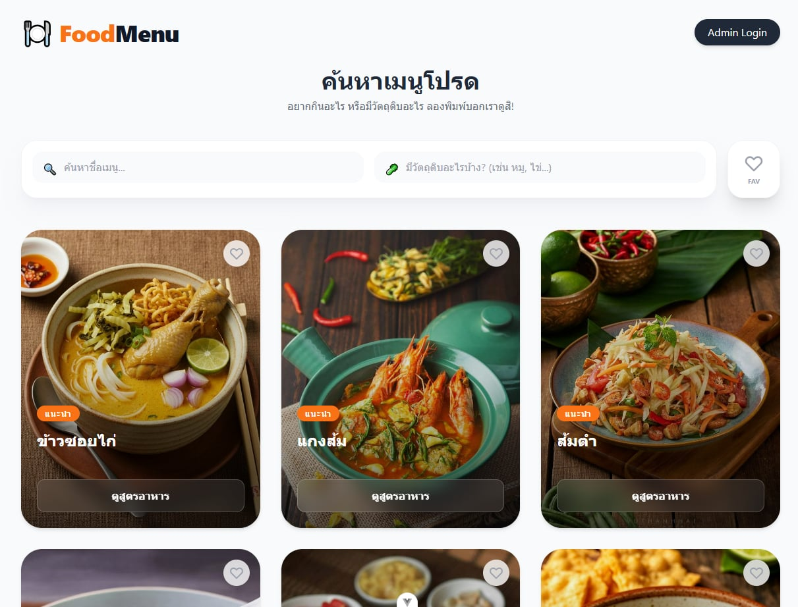
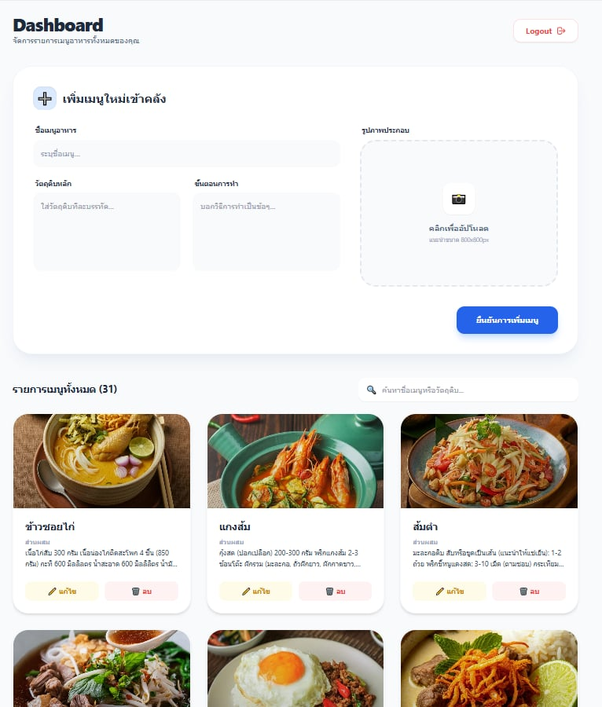

# 🍽️ Food Menu Web App


---

## 📌 Description

เว็บแสดงเมนูอาหาร พร้อมระบบ Admin สำหรับจัดการเมนู
รองรับการเพิ่ม แก้ไข ลบ และอัปโหลดรูปภาพ

---

## 🚀 Features

* 🔐 Admin Login
* ➕ เพิ่ม / ✏️ แก้ไข / 🗑️ ลบเมนู
* 🖼️ อัปโหลดรูปภาพอาหาร
* 🔍 ค้นหาเมนูแบบ realtime
* 📄 หน้าแสดงรายละเอียดเมนู (Menu Detail)

---

## 🛠 Tech Stack

| Frontend     | Backend  | Database |
| ------------ | -------- | -------- |
| Vue 3        | Django   | SQLite   |
| Tailwind CSS | REST API |          |

---

## ▶️ วิธีรันโปรเจค

### 🔹 Backend (Django)

```bash
python manage.py runserver
```

---

### 🔹 Frontend (Vue)

```bash
cd fontend
npm install
npm run dev
```

---

## 🌐 API Endpoint

```bash
GET     /api/menus/
POST    /api/menus/
PUT     /api/menus/
DELETE  /api/menus/
```

---

## 📷 Screenshot

### 🏠 Home


### ⚙️ Admin


---

## 🎯 จุดเด่นของโปรเจค

* ใช้ Fullstack จริง (Vue + Django)
* มีระบบ CRUD ครบ
* รองรับ Upload รูปภาพ
* แยก frontend / backend ชัดเจน
* ใช้ REST API

---

## 👨‍💻 Author

* Maleena MINDO

---

